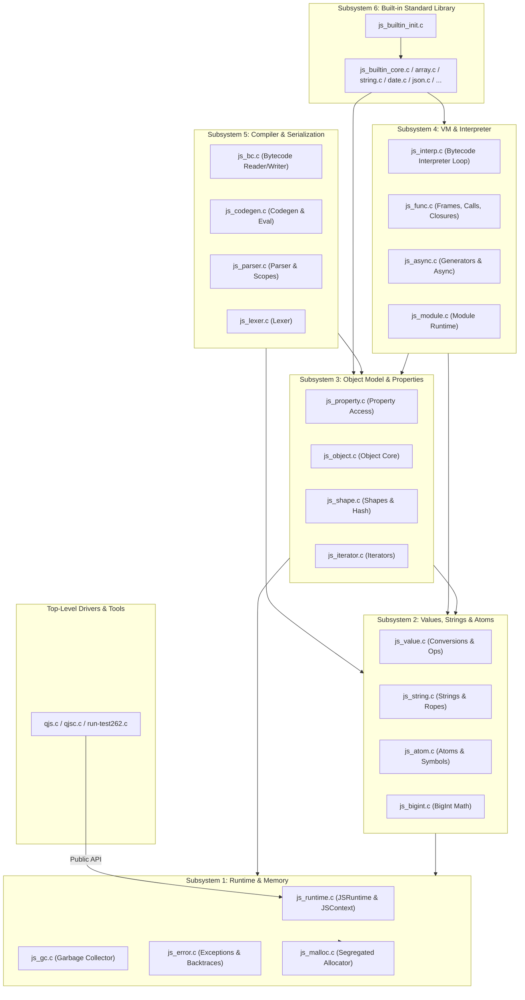

# Refactoring Plan: Modular Architecture for QuickJS

## 1. Executive Summary & Design Principles

The monolithic `quickjs.c` in this repository comprises 61,424 lines of C code combining the memory allocator, garbage collector, atom and string tables, object and shape models, bytecode compiler, virtual machine interpreter, and the entire ECMAScript standard library builtins into a single translation unit.

This document establishes the comprehensive architectural plan to refactor `quickjs.c` into logical, independently compilable C translation units organized into a shallow subsystem-oriented directory tree.

### Core Objectives
1. **True Independent Compilation**: Every resulting `.c` file compiles into a standalone object file (`.o`) linked into `libquickjs.a` and the standalone executables (`qjs`, `qjsc`, `run-test262`). No "unity build" `#include "foo.c"` patterns.
2. **Strict Semantic Preservation**: Maintain 100% compatibility with ECMAScript specifications, existing QuickJS behavior, reference counting, cycle-collection semantics, bytecode formats, and compiler output.
3. **Public API Invariance**: `quickjs.h` remains completely unchanged; no internal structures or engine internals leak into public headers.
4. **Performance Parity**: Preserve hot-path execution speed by strategically keeping critical tiny helpers inline in internal headers (`static inline`), maintaining direct struct field access on critical paths, and retaining out-of-line slow paths.
5. **No Speculative Redesign**: Perform structural refactoring only; avoid gratuitous renames, data structure changes, AST introduction, or interpreter rewrites.
6. **Incremental, Reviewable Migration**: Maintain buildability and testability at every stage of migration.

---

## 2. Proposed Source Tree

The codebase will adopt a shallow subsystem layout rooted at `src/`, with globally distinct filenames to prevent object name collisions in static archive tools across platforms (Linux, macOS, FreeBSD, MinGW, Cosmopolitan).

```text
quickjs-ng2/
├── Makefile                        # Updated to build multiple translation units
├── VERSION
├── quickjs.h                       # UNCHANGED: Public API
├── quickjs-atom.h                  # UNCHANGED: Predefined atom macros
├── quickjs-opcode.h                # UNCHANGED: Bytecode opcode macros
├── quickjs-libc.h / quickjs-libc.c # Unchanged: Libc bindings & host OS
├── cutils.h / cutils.c             # Unchanged: Dynamic buffers & bit utilities
├── list.h                          # Unchanged: Doubly-linked list primitives
├── dtoa.h / dtoa.c                 # Unchanged: Floating point conversions
├── libregexp.h / libregexp.c       # Unchanged: Regular expression engine
├── libunicode.h / libunicode.c     # Unchanged: Unicode database & case folding
├── qjs.c / qjsc.c / run-test262.c  # Unchanged: Drivers and test runners
│
└── src/
    ├── quickjs-internal.h          # Global configuration & forward declarations
    │
    ├── runtime/                    # Subsystem: Runtime Lifecycle & Core Memory
    │   ├── js_malloc.h             # Internal allocator prototypes
    │   ├── js_malloc.c             # Segregated arena allocator & large block manager
    │   ├── js_runtime.h            # JSRuntime & JSContext definitions and lifecycle
    │   ├── js_runtime.c            # Runtime/context creation, stack limit, job queues
    │   ├── js_gc.h                 # Cycle collector & mark/sweep engine
    │   ├── js_gc.c                 # JS_RunGC, mark phase, cycle breaker, weakrefs
    │   ├── js_error.h              # Error creation & backtrace captures
    │   └── js_error.c              # JS_Throw, Error classes, stack trace formatting
    │
    ├── value/                      # Subsystem: Value Primitives, Strings & Atoms
    │   ├── js_atom.h               # Atom table and symbol management
    │   ├── js_atom.c               # Atom allocation, hashing, deduplication, symbols
    │   ├── js_string.h             # String, StringBuffer, and String Rope internals
    │   ├── js_string.c             # String allocation, concat, rope flattening, comparisons
    │   ├── js_value.h              # Value conversions, abstract ops, slow arithmetics
    │   ├── js_value.c              # ToNumber, ToInt32, ToString, StrictEq, slow paths
    │   ├── js_bigint.h             # BigInt internal representations and math
    │   └── js_bigint.c             # Limb arithmetic (add/sub/mul/div/shift), conversions
    │
    ├── object/                     # Subsystem: Object Model, Shapes & Properties
    │   ├── js_object.h             # struct JSObject, allocation, prototypes, exotics
    │   ├── js_object.c             # Object allocation, prototype chains, exotic dispatch
    │   ├── js_shape.h              # struct JSShape, shape hash, inline property lookup
    │   ├── js_shape.c              # Shape transitions, shape hash table, property resizing
    │   ├── js_property.h           # Property get/set/define/delete operations
    │   ├── js_property.c           # JS_GetPropertyInternal, SetProperty, descriptors
    │   ├── js_iterator.h           # Iteration protocol & record management
    │   └── js_iterator.c           # for..in, for..of, enumerate, CopyDataProperties
    │
    ├── vm/                         # Subsystem: Execution Frames, Calls & Bytecode Interpreter
    │   ├── js_func.h               # Execution frames, closures, bytecode function structs
    │   ├── js_func.c               # js_closure, variable references, C function calls
    │   ├── js_interp.h             # Interpreter core interface
    │   ├── js_interp.c             # JS_CallInternal: Bytecode dispatch loop & opcodes
    │   ├── js_async.h              # Generators & Async function state machines
    │   ├── js_async.c              # Generator next/resume, async generator queue
    │   ├── js_module.h             # Module system runtime
    │   └── js_module.c             # JSModuleDef, module linking, import/export evaluation
    │
    ├── compiler/                   # Subsystem: Lexer, Parser, Codegen & Bytecode Serialization
    │   ├── js_lexer.h              # Tokenizer state & keyword definitions
    │   ├── js_lexer.c              # next_token, identifier/numeric/regex lexing
    │   ├── js_parser.h             # Parser state, scopes, variable definitions
    │   ├── js_parser.c             # Recursive descent parser for expressions & statements
    │   ├── js_codegen.h            # Opcode emitter, label resolution, evaluator
    │   ├── js_codegen.c            # emit_op, resolve_labels, peephole optimizer, eval
    │   ├── js_bc.h                 # Bytecode serializer & deserializer
    │   └── js_bc.c                 # JS_ReadObject, JS_WriteObject, binary format tags
    │
    └── builtins/                   # Subsystem: ECMAScript Standard Built-in Objects
        ├── js_builtins.h           # Builtin registration functions & class definitions
        ├── js_builtin_core.c       # Object, Function, Error builtins
        ├── js_builtin_array.c      # Array, Array.prototype, Quicksort/Timsort, slice/splice
        ├── js_builtin_string.c     # String, RegExp, Symbol builtins & StringNormalize
        ├── js_builtin_number.c     # Number, Math (PRNG xorshift*), BigInt builtins
        ├── js_builtin_date.c       # Date constructor, ISO date parser, date formatting
        ├── js_builtin_json.c       # JSON.parse & JSON.stringify
        ├── js_builtin_proxy.c      # Proxy constructor, Reflect object, exotic traps
        ├── js_builtin_collections.c# Map, Set, WeakMap, WeakSet, WeakRef, FinalizationRegistry
        ├── js_builtin_promise.c    # Promise, AsyncFunction, Iterator & Iterator Helper
        ├── js_builtin_typedarray.c # ArrayBuffer, SharedArrayBuffer, DataView, TypedArray, Atomics
        └── js_builtin_init.c       # Global object initialization & intrinsic dispatch
```

---

## 3. Subsystem Breakdown and Module Responsibilities

### Subsystem 1: Runtime (`src/runtime/`)

* **`js_malloc.c` / `js_malloc.h`**:
  * **Responsibility**: Owns QuickJS's segregated size-class memory allocator (`JSMallocContext`, `JSMallocArena`). Manages 16 to 512-byte small arenas, large blocks, zero-size blocks, and fallback custom malloc hooks (`JSMallocFunctions`).
  * **Data Owned**: `JSMallocBlockHeader`, `JSMallocLargeBlockHeader`, `JSMallocArena`, `JSMallocContext`.
  * **Key Exports**: `js_malloc_init`, `__js_malloc`, `__js_free`, `__js_realloc`, `__js_malloc_usable_size`, `js_def_malloc`, `js_def_free`, `js_def_realloc`, `js_def_malloc_usable_size`.
  * **Encapsulation**: Segregated bucket calculations, arena free-lists, and block headers remain strictly internal.

* **`js_runtime.c` / `js_runtime.h`**:
  * **Responsibility**: Owns the lifecycle of `JSRuntime` and `JSContext`. Manages stack overflow limits, interrupt callbacks, class registration (`JSClass` table), and asynchronous microtask execution (`JSJobEntry` queue).
  * **Data Owned**: `struct JSRuntime`, `struct JSContext`, `struct JSClass`, `JSClassShortDef`, `JSJobEntry`.
  * **Key Exports**: `JS_NewRuntime2`, `JS_FreeRuntime`, `JS_NewContext`, `JS_FreeContext`, `init_class_range`, `JS_NewClass1`, `JS_EnqueueJob2`, `JS_ExecutePendingJob`.
  * **Hot Helpers**: `js_check_stack_overflow(rt, alloca_size)`, `js_get_stack_pointer()`, `is_strict_mode(ctx)`.

* **`js_gc.c` / `js_gc.h`**:
  * **Responsibility**: Implements the cycle-detecting mark-and-sweep garbage collector. Maintains active GC lists (`gc_obj_list`, `gc_zero_ref_count_list`), tracks GC phases (`JS_GC_PHASE_DECREF`, `JS_GC_PHASE_REMOVE_CYCLES`), executes cycle breaking, and manages weak reference lists.
  * **Data Owned**: `struct JSGCObjectHeader`, `JSWeakRefHeader`, GC list anchors.
  * **Key Exports**: `JS_RunGCInternal`, `JS_RunGC`, `JS_MarkValue`, `JS_MarkContext`, `gc_decref`, `add_gc_object`, `remove_gc_object`.
  * **Encapsulation**: Internal cycle detection traversal and mark bits are private to this unit.

* **`js_error.c` / `js_error.h`**:
  * **Responsibility**: Manages JavaScript exception generation, error object formatting, uncaught exception state, and stack backtrace capture.
  * **Data Owned**: `JSErrorEnum`.
  * **Key Exports**: `JS_Throw`, `JS_GetException`, `JS_HasException`, `JS_ThrowError`, `JS_ThrowOutOfMemory`, `JS_ThrowStackOverflow`, `JS_ThrowTypeError`, `JS_ThrowReferenceError`, `JS_ThrowSyntaxError`, `JS_ThrowRangeError`, `JS_ThrowInternalError`, `build_backtrace`.

---

### Subsystem 2: Values, Strings & Atoms (`src/value/`)

* **`js_atom.c` / `js_atom.h`**:
  * **Responsibility**: String interning and Symbol table management. Maintains runtime hash table (`rt->atom_hash`, `rt->atom_array`), handles constant atoms (from `quickjs-atom.h`), tagged integer atoms, and symbol atoms.
  * **Data Owned**: `JSAtomStruct`, atom hash table arrays.
  * **Key Exports**: `JS_InitAtoms`, `__JS_NewAtom`, `__JS_NewAtomInit`, `__JS_FindAtom`, `JS_FreeAtomStruct`, `__JS_FreeAtom`, `JS_AtomToValue`, `__JS_AtomToValue`, `JS_ValueToAtom`, `JS_AtomGetStr`, `JS_AtomGetStrRT`, `js_symbol_to_atom`, `JS_NewSymbol`.
  * **Hot Helpers**: `__JS_AtomIsConst`, `__JS_AtomIsTaggedInt`, `__JS_AtomFromUInt32`, `__JS_AtomToUInt32`, `atom_get_free`, `atom_is_free`, `atom_set_free`.

* **`js_string.c` / `js_string.h`**:
  * **Responsibility**: Representation of 8-bit (Latin1) and 16-bit (UTF-16) strings, string ropes (`JSStringRope`), and dynamic string builder buffers (`StringBuffer`). Handles rope concatenation, flattening, slicing, hashing, and lexical comparisons.
  * **Data Owned**: `struct JSString`, `struct JSStringRope`, `StringBuffer`.
  * **Key Exports**: `js_alloc_string_rt`, `js_alloc_string`, `JS_NewStringLen`, `JS_ConcatString1`, `JS_ConcatString3`, `js_string_memcmp`, `js_string_compare`, `js_string_eq`, `string_buffer_init`, `string_buffer_concat`, `string_buffer_to_string`, `string_buffer_free`.
  * **Hot Helpers**: `js_free_string(rt, str)`, `string_buffer_putc(s, c)`, `string_get(p, idx)`, `hash_string8`, `hash_string16`.

* **`js_value.c` / `js_value.h`**:
  * **Responsibility**: ECMAScript abstract operations (`ToNumber`, `ToInt32`, `ToFloat64`, `ToNumeric`, `ToString`, `ToPropertyKey`, `ToPrimitive`), strict and same-value equality comparisons, and slow arithmetic fallbacks.
  * **Key Exports**: `JS_ToBoolFree`, `JS_ToInt32Free`, `JS_ToFloat64Free`, `JS_ToNumberFree`, `JS_ToStringFree`, `JS_ToPropertyKey`, `JS_ToPrimitiveFree`, `JS_StrictEq`, `js_strict_eq`, `js_strict_eq2`, `JS_SameValue`, `js_same_value`, `JS_SameValueZero`, `js_same_value_zero`.
  * **Out-of-Line Slow Paths**: `js_add_slow`, `js_sub_slow`, `js_binary_arith_slow`, `js_unary_arith_slow`, `js_relational_slow`, `js_eq_slow`, `js_shr_slow`.
  * **Hot Helpers**: `set_value(ctx, pval, new_val)`.

* **`js_bigint.c` / `js_bigint.h`**:
  * **Responsibility**: Arbitrary precision limb math (two's complement integers). Limb-level addition, subtraction, multiplication, division, bitwise shifts, and radix string conversions.
  * **Data Owned**: `struct JSBigInt`, `JSBigIntBuf`, `js_limb_t`.
  * **Key Exports**: `js_bigint_new_ui64`, `js_bigint_new_si64`, `JS_NewBigInt64`, `JS_NewBigUint64`, `JS_ToBigInt64`, `js_bigint_to_string1`, `js_bigint_to_int64`, limb math operations.

---

### Subsystem 3: Object Model & Properties (`src/object/`)

* **`js_shape.c` / `js_shape.h`**:
  * **Responsibility**: The hidden-class / shape engine. Maintains shape transitions, shape property layouts (`JSShapeProperty`), hash tables (`sh->hash_table`), shape sharing in `rt->shape_hash`, and prototype pointers.
  * **Data Owned**: `struct JSShape`, `struct JSShapeProperty`.
  * **Key Exports**: `init_shape_hash`, `js_free_shape`, `js_new_shape2`, `js_shape_prepare_update`.
  * **CRITICAL Inline Helpers**: `get_shape_prop(sh)`, `find_own_property(ppr, p, atom)`, `find_own_property1(p, atom)` (vital for interpreter and property lookup performance).

* **`js_object.c` / `js_object.h`**:
  * **Responsibility**: Core object representation (`struct JSObject`), memory layout, allocation, prototype delegation, and exotic method dispatch (`JSClassExoticMethods`).
  * **Data Owned**: `struct JSObject`, `struct JSProperty`, `JSPropertyEnum`.
  * **Key Exports**: `JS_NewObjectFromShape`, `JS_NewObjectClass`, `JS_NewObjectProtoClassAlloc`, `JS_NewObjectProtoClass`, `JS_NewObjectProto`, `JS_NewArray`, `JS_NewObject`, `free_object`, `set_cycle_flag`, `JS_GetPrototype`, `JS_SetPrototype`, `JS_IsExtensible`, `JS_PreventExtensions`, `js_get_fast_array`.

* **`js_property.c` / `js_property.h`**:
  * **Responsibility**: Complete property access pipelines. Handles fast-path property get/set, property insertion (`add_property`), property deletion, getter/setter invocations, and exotic property handlers.
  * **Key Exports**: `JS_GetPropertyInternal`, `JS_SetPropertyInternal`, `JS_DefinePropertyValue`, `JS_DefinePropertyGetSet`, `JS_DeleteProperty`, `JS_GetOwnPropertyInternal`, `JS_GetOwnPropertyNames`, `add_property`, `free_property`, `JS_CreateProperty`, `JS_AutoInitProperty`.

* **`js_iterator.c` / `js_iterator.h`**:
  * **Responsibility**: Iteration protocols. Manages `for..in` property enumerations (`JSForInIterator`), `for..of` iterator records, `JS_CopyDataProperties`, and `JS_IteratorClose`.
  * **Data Owned**: `JSForInIterator`, `JSIteratorKindEnum`.
  * **Key Exports**: `js_for_of_start`, `js_for_of_next`, `js_for_await_of_next`, `js_iterator_get_value_done`, `JS_IteratorClose`, `JS_IteratorGetCompleteValue`, `js_create_iterator_result`, `js_append_enumerate`, `JS_CopyDataProperties`.

---

### Subsystem 4: VM Execution & Interpreter (`src/vm/`)

* **`js_func.c` / `js_func.h`**:
  * **Responsibility**: Function execution frames, variable references for closures (`JSVarRef`, `JSClosureVar`), compiled bytecode function representation (`JSFunctionBytecode`), and native C function invocation (`js_call_c_function`).
  * **Data Owned**: `JSStackFrame`, `JSFunctionBytecode`, `JSBytecodeVarDef`, `JSClosureVar`, `JSClosureTypeEnum`, `JSVarKindEnum`, `JSVarRef`, `JSBoundFunction`.
  * **Key Exports**: `js_create_var_ref`, `get_var_ref`, `free_var_ref`, `close_var_ref`, `close_var_refs`, `js_closure`, `js_closure2`, `js_call_c_function`, `js_call_bound_function`, `free_function_bytecode`, `JS_Call`, `JS_CallFree`, `JS_CallConstructor`, `JS_CallConstructorInternal`, `JS_InvokeFree`.

* **`js_interp.c` / `js_interp.h`**:
  * **Responsibility**: Virtual Machine core. Implements `JS_CallInternal` containing the direct-threaded opcode dispatch loop, stack frame execution, fast-path operand evaluation, and interpreter exception handlers.
  * **Key Exports**: `JSValue JS_CallInternal(JSContext *caller_ctx, JSValueConst func_obj, JSValueConst this_obj, JSValueConst new_target, int argc, JSValue *argv, int flags);`

* **`js_async.c` / `js_async.h`**:
  * **Responsibility**: Generators, Async functions, and Async Generators. Manages paused stack frame preservation (`JSAsyncFunctionState`, `JSGeneratorData`), promise capability interaction, and async generator request queues.
  * **Data Owned**: `JSAsyncFunctionState`, `JSGeneratorData`, `JSAsyncGeneratorData`, `JSAsyncGeneratorRequest`.
  * **Key Exports**: `async_func_init`, `async_func_resume`, `async_func_free`, `js_generator_next`, `js_generator_function_call`, `js_generator_finalizer`, `js_generator_mark`, `js_async_generator_next`, `js_async_generator_function_call`.

* **`js_module.c` / `js_module.h`**:
  * **Responsibility**: ECMAScript Modules runtime. Manages module records (`JSModuleDef`), requested imports/exports, namespace object creation, asynchronous module graph evaluation, and C-module registration.
  * **Data Owned**: `struct JSModuleDef`, `JSReqModuleEntry`, `JSExportEntry`, `JSStarExportEntry`, `JSImportEntry`, `JSModuleStatus`.
  * **Key Exports**: `js_free_module_def`, `js_mark_module_def`, `find_export_entry`, `add_export_entry`, `js_link_module`, `js_evaluate_module`, `JS_NewCModule`, `JS_AddModuleExport`, `JS_GetModuleNamespace`, `js_dynamic_import`.

---

### Subsystem 5: Compiler & Parser (`src/compiler/`)

* **`js_lexer.c` / `js_lexer.h`**:
  * **Responsibility**: Lexical tokenizer. Converts source Unicode characters into ECMAScript token stream (`next_token`), handles keyword lookup tables, numeric literals (decimal, hex, binary, bigints), string escapes, template literal scanning, and regex tokens.
  * **Data Owned**: `JSToken`, token constants.
  * **Key Exports**: `next_token`, `js_parse_skip_parens_token`, `has_lf_in_range`.

* **`js_parser.c` / `js_parser.h`**:
  * **Responsibility**: Single-pass recursive descent parser. Parses expressions, statements, variable declarations, class bodies, and function declarations. Maintains lexically scoped identifier environments (`JSVarScope`, `JSVarDef`).
  * **Data Owned**: `JSParseState`, `JSParsePos`, `JSFunctionDef`, `JSVarScope`, `JSVarDef`, `LineNumberSlot`, `JumpSlot`, `LabelSlot`, `RelocEntry`, `BlockEnv`.
  * **Key Exports**: `js_parse_program`, `js_parse_source_element`, `js_parse_statement`, `js_parse_expr`, `js_parse_function_decl`, `js_parse_class`, `add_var`, `find_var_in_scope`, `define_var`, `add_closure_var`.

* **`js_codegen.c` / `js_codegen.h`**:
  * **Responsibility**: Single-pass bytecode emission and optimization. Emits opcodes into dynamic buffers (`emit_op`), resolves forward/backward jump labels (`resolve_labels`), performs peephole dead-code elimination, computes maximum stack depth, compiles `JSFunctionBytecode`, and exports the `JS_Eval` family.
  * **Key Exports**: `emit_op`, `emit_atom`, `emit_u8`, `emit_u16`, `emit_u32`, `emit_source_pos`, `update_label`, `resolve_labels`, `code_match`, `compute_stack_size`, `js_create_function`, `__JS_EvalInternal`, `JS_EvalInternal`, `JS_EvalObject`, `JS_Eval`, `JS_EvalThis`, `JS_EvalFunction`, `JS_DetectModule`.

* **`js_bc.c` / `js_bc.h`**:
  * **Responsibility**: Bytecode reader and writer. Serializes compiled functions and object graphs to binary format (`JS_WriteObject`) and deserializes them back (`JS_ReadObject`), handling bytecode versions and LEB128 encoding.
  * **Data Owned**: `BCWriterState`, `BCReaderState`, `BC_TAG_...` enums.
  * **Key Exports**: `JS_WriteObject`, `JS_WriteObjectRec`, `JS_ReadObject`, `JS_ReadObjectRec`.

---

### Subsystem 6: Standard Library Builtins (`src/builtins/`)

Each builtin file encapsulates the prototype functions, constructor functions, and class definitions for a logical ECMAScript standard object group.

* **`js_builtin_core.c`**: Object (`Object.prototype`, `Object.defineProperty`, `keys`), Function (`bind`, `call`, `apply`), Error (`Error.prototype`, native error classes).
* **`js_builtin_array.c`**: Array (`Array.prototype`, `slice`, `splice`, `concat`, Quicksort / TimSort `js_array_sort`).
* **`js_builtin_string.c`**: String methods, String Iterator, RegExp object, RegExp compiler hook (`JS_AddIntrinsicRegExpCompiler`), Symbol builtin, `JS_AddIntrinsicStringNormalize`.
* **`js_builtin_number.c`**: Number methods, Math object (Marsaglia xorshift* PRNG, transcendentals), BigInt standard methods.
* **`js_builtin_date.c`**: Date object, ISO date string parsing, UTC/timezone formatting, `JS_AddIntrinsicDate`.
* **`js_builtin_json.c`**: `JSON.parse` recursive descent parser and `JSON.stringify` serializer, `JS_AddIntrinsicJSON`.
* **`js_builtin_proxy.c`**: Proxy constructor, Reflect object, exotic Proxy trap dispatchers (`js_proxy_get`, `js_proxy_set`, etc.), `JS_AddIntrinsicProxy`.
* **`js_builtin_collections.c`**: Map, Set, WeakMap, WeakSet, Map/Set iterators, WeakRef, FinalizationRegistry, `JS_AddIntrinsicMapSet`, `JS_AddIntrinsicWeakRef`.
* **`js_builtin_promise.c`**: Promise constructor, capability management, `perform_promise_then`, `Promise.all`, Iterator & Iterator Helper prototypes, `JS_AddIntrinsicPromise`.
* **`js_builtin_typedarray.c`**: ArrayBuffer, SharedArrayBuffer, DataView, TypedArray constructors/prototypes, Base64/Hex encoding, Atomics, `JS_AddIntrinsicTypedArrays`.
* **`js_builtin_init.c`**: Global object initialization (`globalThis`, `eval`, `parseInt`, `parseFloat`, URI handling), `JS_AddIntrinsicBaseObjects`, `JS_AddIntrinsicBasicObjects`.

---

## 4. Inter-Module Dependency Flow



### Layer Ordering
1. **Memory & Runtime Foundation**: `src/runtime/` (`js_malloc`, `js_runtime`, `js_gc`, `js_error`).
2. **Primitive Types & Tables**: `src/value/` (`js_atom`, `js_string`, `js_value`, `js_bigint`).
3. **Object Model**: `src/object/` (`js_shape`, `js_object`, `js_property`, `js_iterator`).
4. **Execution Engine**: `src/vm/` (`js_func`, `js_interp`, `js_async`, `js_module`).
5. **Compilation & Serialization**: `src/compiler/` (`js_lexer`, `js_parser`, `js_codegen`, `js_bc`).
6. **Standard Library**: `src/builtins/` (`js_builtin_*.c`).

Every dependency points strictly downwards or within the same subsystem layer.

---

## 5. Expected Internal Headers

Internal headers use include guards prefixed with `QUICKJS_` and declare only subsystem-facing symbols.

| Header | Primary Types Owned | Key Exposed Functions | Permitted Includers | Private to `.c` |
| :--- | :--- | :--- | :--- | :--- |
| `src/runtime/js_malloc.h` | `JSMallocBlockHeader`, `JSMallocArena`, `JSMallocContext` | `js_malloc_init`, `__js_malloc`, `__js_free`, `__js_realloc`, `__js_malloc_usable_size` | `runtime/*`, `value/js_string.h`, `value/js_atom.h` | Arena bucket index logic, block header packing |
| `src/runtime/js_runtime.h` | `struct JSRuntime`, `struct JSContext`, `struct JSClass`, `JSClassShortDef`, `JSJobEntry` | `JS_NewRuntime2`, `JS_FreeRuntime`, `JS_NewContext`, `JS_FreeContext`, `init_class_range`, `JS_NewClass1`, `JS_EnqueueJob2` | All modules | Microtask queue node links, internal thread ID checks |
| `src/runtime/js_gc.h` | `struct JSGCObjectHeader`, `JSGCPhaseEnum`, `JSWeakRefHeader` | `JS_RunGCInternal`, `JS_MarkValue`, `JS_MarkContext`, `gc_decref`, `add_gc_object`, `remove_gc_object` | `runtime/*`, `object/*`, `vm/*` | Cycle detection graph coloring, sweep loop details |
| `src/runtime/js_error.h` | `JSErrorEnum` | `JS_ThrowError`, `JS_ThrowOutOfMemory`, `JS_ThrowStackOverflow`, `JS_ThrowTypeError`, `JS_ThrowReferenceError`, `build_backtrace` | All modules | Backtrace line table unpacking |
| `src/value/js_atom.h` | `JSAtomStruct`, `JSAtomKindEnum` | `JS_InitAtoms`, `__JS_NewAtom`, `__JS_FindAtom`, `JS_FreeAtomStruct`, `__JS_FreeAtom`, `JS_AtomToValue`, `js_symbol_to_atom` | All modules | Atom hash resize rehash step |
| `src/value/js_string.h` | `struct JSString`, `struct JSStringRope`, `StringBuffer` | `js_alloc_string`, `js_free_string` (inline), `JS_NewStringLen`, `JS_ConcatString3`, `js_string_compare`, `string_buffer_init`, `string_buffer_concat` | All modules | Rope rebalance tree rotation logic |
| `src/value/js_value.h` | `JSStrictEqModeEnum` | `JS_ToBoolFree`, `JS_ToInt32Free`, `JS_ToFloat64Free`, `JS_ToNumberFree`, `JS_ToStringFree`, `JS_ToPropertyKey`, `js_strict_eq`, `js_same_value`, `set_value` (inline), slow arithmetics | All modules | IEEE-754 bitwise corner casing in slow relational ops |
| `src/value/js_bigint.h` | `struct JSBigInt`, `JSBigIntBuf`, `js_limb_t` | `js_bigint_new_ui64`, `js_bigint_new_si64`, `js_bigint_to_string1`, `js_bigint_to_int64`, limb math | `value/*`, `vm/*`, `compiler/*`, `builtins/*` | Limb division Knuth Algorithm D subroutines |
| `src/object/js_shape.h` | `struct JSShape`, `struct JSShapeProperty` | `init_shape_hash`, `js_free_shape`, `js_new_shape2`, `js_shape_prepare_update`, `find_own_property` (inline), `find_own_property1` (inline), `get_shape_prop` (inline) | `object/*`, `vm/*`, `builtins/*` | Shape rehash table allocation slack details |
| `src/object/js_object.h` | `struct JSObject`, `struct JSProperty`, `JSPropertyEnum` | `JS_NewObjectFromShape`, `JS_NewObjectClass`, `JS_NewObjectProtoClassAlloc`, `free_object`, `set_cycle_flag`, `JS_GetPrototype`, `JS_SetPrototype`, `js_get_fast_array` | All modules | Object layout allocation alignment macros |
| `src/object/js_property.h` | `JSPropertyDescriptor` | `JS_GetPropertyInternal`, `JS_SetPropertyInternal`, `JS_DefinePropertyValue`, `JS_DeleteProperty`, `JS_GetOwnPropertyInternal`, `add_property`, `free_property` | `object/*`, `vm/*`, `compiler/*`, `builtins/*` | Prototype chain iteration loop details |
| `src/object/js_iterator.h` | `JSForInIterator`, `JSIteratorKindEnum` | `js_for_of_start`, `js_for_of_next`, `js_iterator_get_value_done`, `JS_IteratorClose`, `JS_CopyDataProperties` | `object/*`, `vm/*`, `builtins/*` | For-in property array deduplication cache |
| `src/vm/js_func.h` | `JSStackFrame`, `JSFunctionBytecode`, `JSVarRef`, `JSClosureVar`, `JSBoundFunction` | `js_create_var_ref`, `get_var_ref`, `free_var_ref`, `close_var_refs`, `js_closure`, `js_call_c_function`, `js_call_bound_function`, `free_function_bytecode`, `JS_CallConstructorInternal` | `vm/*`, `compiler/*`, `builtins/*` | Stack frame alloca layout packing |
| `src/vm/js_interp.h` | Execution flags | `JS_CallInternal` | `vm/js_func.c`, `vm/js_async.c`, `compiler/js_codegen.c` | Opcode jump table labels (`&&case_OP_...`) |
| `src/vm/js_async.h` | `JSAsyncFunctionState`, `JSGeneratorData`, `JSAsyncGeneratorData` | `async_func_init`, `async_func_resume`, `async_func_free`, `js_generator_next`, `js_async_generator_next` | `vm/*`, `builtins/js_builtin_promise.c` | Suspended stack copy memory offsets |
| `src/vm/js_module.h` | `struct JSModuleDef`, `JSExportEntry`, `JSImportEntry` | `js_free_module_def`, `js_mark_module_def`, `js_link_module`, `js_evaluate_module`, `js_dynamic_import` | `vm/*`, `compiler/*`, `runtime/*` | Depth-first search tarjan cycle detection data |
| `src/compiler/js_lexer.h`| `JSToken` | `next_token`, `js_parse_skip_parens_token` | `compiler/*` | UTF-8 surrogate pairing buffers |
| `src/compiler/js_parser.h`| `JSParseState`, `JSFunctionDef`, `JSVarScope`, `JSVarDef` | `js_parse_program`, `js_parse_expr`, `js_parse_statement`, `add_var`, `define_var` | `compiler/*` | Intermediate parse position stack |
| `src/compiler/js_codegen.h`| `CodeContext` | `emit_op`, `emit_atom`, `resolve_labels`, `js_create_function`, `__JS_EvalInternal` | `compiler/*`, `vm/*`, `builtins/*` | Peephole opcode pattern replacement tables |
| `src/compiler/js_bc.h` | `BCWriterState`, `BCReaderState` | `JS_WriteObject`, `JS_ReadObject` | `compiler/*`, `builtins/*`, `vm/*` | Serialized atom mapping tables |
| `src/builtins/js_builtins.h`| Class definition tables | `JS_AddIntrinsicBaseObjects`, `JS_AddIntrinsic...`, builtin class finalizers | `runtime/js_runtime.c`, `builtins/*` | Method function tables (`JSCFunctionListEntry`) |

---

## 6. Static Symbols Becoming Internal Non-Static APIs

The following important symbols currently marked `static` in `quickjs.c` will receive internal cross-translation-unit linkage:

### Memory & Runtime
* `__js_malloc`, `__js_free`, `__js_realloc`, `__js_malloc_usable_size` (`quickjs.c:1549-1699`) -> Declared in `js_malloc.h`.
* `js_malloc_init` (`quickjs.c:1473`) -> Declared in `js_malloc.h`.
* `init_class_range` (`quickjs.c:2024`) -> Declared in `js_runtime.h`.
* `JS_NewClass1` (`quickjs.c:3860`) -> Declared in `js_runtime.h`.
* `JS_EnqueueJob2` (`quickjs.c:2263`) -> Declared in `js_runtime.h`.
* `JS_RunGCInternal` (`quickjs.c:6808`) -> Declared in `js_gc.h`.
* `gc_decref` (`quickjs.c:6431`) -> Declared in `js_gc.h`.
* `add_gc_object`, `remove_gc_object` (`quickjs.c:6509-6523`) -> Declared in `js_gc.h`.
* `JS_ThrowError2` (`quickjs.c:7638`) -> Declared in `js_error.h`.
* `build_backtrace` (`quickjs.c:7550`) -> Declared in `js_error.h`.

### Atoms & Strings
* `JS_InitAtoms` (`quickjs.c:3078`) -> Declared in `js_atom.h`.
* `__JS_NewAtom`, `__JS_NewAtomInit`, `__JS_FindAtom` (`quickjs.c:3179-3348`) -> Declared in `js_atom.h`.
* `JS_FreeAtomStruct`, `__JS_FreeAtom` (`quickjs.c:3374-3423`) -> Declared in `js_atom.h`.
* `__JS_AtomToValue` (`quickjs.c:3595`) -> Declared in `js_atom.h`.
* `js_symbol_to_atom`, `JS_NewSymbol` (`quickjs.c:3517, 8996`) -> Declared in `js_atom.h`.
* `js_alloc_string_rt`, `js_alloc_string` (`quickjs.c:2355-2373`) -> Declared in `js_string.h`.
* `JS_ConcatString1`, `JS_ConcatString3` (`quickjs.c:4646, 4976`) -> Declared in `js_string.h`.
* `js_string_memcmp`, `js_string_compare`, `js_string_eq` (`quickjs.c:4590-4616`) -> Declared in `js_string.h`.
* `string_buffer_init`, `string_buffer_concat`, `string_buffer_to_string`, `string_buffer_free` (`quickjs.c:3999-4235`) -> Declared in `js_string.h`.

### Values & Operations
* `JS_ToBoolFree`, `JS_ToInt32Free`, `JS_ToFloat64Free`, `JS_ToNumberFree`, `JS_ToStringFree`, `JS_ToPrimitiveFree` (`quickjs.c:1248-1352`) -> Declared in `js_value.h`.
* `js_strict_eq`, `js_strict_eq2`, `js_same_value`, `js_same_value_zero` (`quickjs.c:15840-15935`) -> Declared in `js_value.h`.
* `js_add_slow`, `js_sub_slow`, `js_binary_arith_slow`, `js_unary_arith_slow`, `js_relational_slow`, `js_eq_slow` (`quickjs.c:14720-15735`) -> Declared in `js_value.h`.
* `js_bigint_new_ui64`, `js_bigint_new_si64`, `js_bigint_to_string1`, `js_bigint_to_int64` (`quickjs.c:11688-12634`) -> Declared in `js_bigint.h`.

### Objects & Shapes
* `init_shape_hash` (`quickjs.c:5156`) -> Declared in `js_shape.h`.
* `js_free_shape`, `js_new_shape2`, `js_shape_prepare_update` (`quickjs.c:5200-5450`) -> Declared in `js_shape.h`.
* `JS_NewObjectFromShape`, `JS_NewObjectProtoClassAlloc` (`quickjs.c:5613, 5635`) -> Declared in `js_object.h`.
* `free_object` (`quickjs.c:6349`) -> Declared in `js_object.h`.
* `set_cycle_flag` (`quickjs.c:6160`) -> Declared in `js_object.h`.
* `JS_GetPropertyInternal`, `JS_SetPropertyInternal` (`quickjs.c:8364, 9663`) -> Declared in `js_property.h`.
* `JS_GetOwnPropertyInternal` (`quickjs.c:8815`) -> Declared in `js_property.h`.
* `add_property`, `free_property` (`quickjs.c:9179, 9350`) -> Declared in `js_property.h`.
* `JS_CreateProperty`, `JS_AutoInitProperty` (`quickjs.c:8167, 10735`) -> Declared in `js_property.h`.
* `js_for_of_start`, `js_for_of_next`, `JS_IteratorClose`, `JS_CopyDataProperties` (`quickjs.c:16665-16897`) -> Declared in `js_iterator.h`.

### VM & Execution
* `js_create_var_ref`, `get_var_ref`, `free_var_ref`, `close_var_ref`, `close_var_refs` (`quickjs.c:16978-17545`) -> Declared in `js_func.h`.
* `js_closure`, `js_closure2` (`quickjs.c:17262-17369`) -> Declared in `js_func.h`.
* `js_call_c_function`, `js_call_bound_function` (`quickjs.c:17562-17691`) -> Declared in `js_func.h`.
* `free_function_bytecode` (`quickjs.c:6220`) -> Declared in `js_func.h`.
* `JS_CallInternal` (`quickjs.c:17746`) -> Declared in `js_interp.h`.
* `JS_CallConstructorInternal`, `JS_CallFree`, `JS_InvokeFree` (`quickjs.c:20724-20893`) -> Declared in `js_func.h`.
* `async_func_init`, `async_func_resume`, `async_func_free` (`quickjs.c:20893-21007`) -> Declared in `js_async.h`.
* `js_generator_next`, `js_generator_function_call` (`quickjs.c:21077, 21159`) -> Declared in `js_async.h`.
* `js_async_generator_next`, `js_async_generator_function_call` (`quickjs.c:21706, 21749`) -> Declared in `js_async.h`.
* `js_free_module_def`, `js_mark_module_def`, `js_link_module`, `js_evaluate_module` (`quickjs.c:30700-31100`) -> Declared in `js_module.h`.

### Compiler & Bytecode
* `next_token`, `js_parse_skip_parens_token` (`quickjs.c:22829, 24800`) -> Declared in `js_lexer.h`.
* `js_parse_program`, `js_parse_expr`, `js_parse_statement` (`quickjs.c:26832, 28000, 31500`) -> Declared in `js_parser.h`.
* `emit_op`, `emit_atom`, `emit_u8`, `emit_u16`, `emit_u32`, `resolve_labels`, `js_create_function`, `__JS_EvalInternal` (`quickjs.c:23837-23873, 34796, 36500, 37000`) -> Declared in `js_codegen.h`.
* `JS_WriteObjectRec`, `JS_ReadObjectRec` (`quickjs.c:37824, 39312`) -> Declared in `js_bc.h`.

---

## 7. Performance-Critical `static inline` Helpers

To prevent performance regressions on sub-10ns operations, the following tiny helpers will be placed in internal headers as `static inline` or `static force_inline`:

### 1. Shape & Property Lookup (`src/object/js_shape.h`)
```c
static force_inline JSShapeProperty *get_shape_prop(JSShape *sh) {
    return (JSShapeProperty *)((uint8_t *)sh->hash_table +
                               sizeof(uint32_t) * (sh->prop_hash_mask + 1));
}

static force_inline JSShapeProperty *find_own_property(JSProperty **ppr,
                                                       JSObject *p,
                                                       JSAtom atom) {
    JSShape *sh = p->shape;
    intptr_t h = (uintptr_t)atom & sh->prop_hash_mask;
    h = sh->hash_table[h];
    JSShapeProperty *prop = get_shape_prop(sh);
    while (h) {
        JSShapeProperty *pr = &prop[h - 1];
        if (likely(pr->atom == atom)) {
            *ppr = &p->prop[h - 1];
            return pr;
        }
        h = pr->hash_next;
    }
    *ppr = NULL;
    return NULL;
}

static force_inline JSShapeProperty *find_own_property1(JSObject *p, JSAtom atom) {
    JSShape *sh = p->shape;
    intptr_t h = (uintptr_t)atom & sh->prop_hash_mask;
    h = sh->hash_table[h];
    JSShapeProperty *prop = get_shape_prop(sh);
    while (h) {
        JSShapeProperty *pr = &prop[h - 1];
        if (likely(pr->atom == atom))
            return pr;
        h = pr->hash_next;
    }
    return NULL;
}
```
* **Performance Justification**: `prop_read` takes 8.64 ns (~26 cycles on modern CPUs). Cross-TU call prologue, register spills, and return would add 10-15 cycles, causing an intolerable 35-50% regression on property lookups in `JS_CallInternal`. Header inlining is mandatory.

### 2. Value Assignment (`src/value/js_value.h`)
```c
static inline void set_value(JSContext *ctx, JSValue *pval, JSValue new_val) {
    JSValue old_val = *pval;
    *pval = new_val;
    JS_FreeValue(ctx, old_val);
}
```
* **Performance Justification**: Used on every property write, variable assignment, and array update. Inlining allows the compiler to optimize out `JS_FreeValue` when `old_val` is statically known to be a primitive or tag without refcount.

### 3. Fast String Free (`src/value/js_string.h`)
```c
static inline void js_free_string(JSRuntime *rt, JSString *str) {
    --str->header.ref_count;
    if (str->header.ref_count <= 0)
        __js_free_string(rt, str);
}
```
* **Performance Justification**: Inlining the refcount decrement fast-path avoids an indirect or cross-TU function call whenever temporary strings are released.

### 4. Stack Limit Check (`src/runtime/js_runtime.h`)
```c
#if !defined(CONFIG_STACK_CHECK)
static inline BOOL js_check_stack_overflow(JSRuntime *rt, size_t alloca_size) {
    return FALSE;
}
#else
static inline BOOL js_check_stack_overflow(JSRuntime *rt, size_t alloca_size) {
    uintptr_t sp = (uintptr_t)__builtin_frame_address(0) - alloca_size;
    return unlikely(sp < rt->stack_limit);
}
#endif
```
* **Performance Justification**: Called on every function call and recursion entry. A function call to check for a stack overflow would defeat the purpose of cheap call setup.

### 5. String Buffer Append (`src/value/js_string.h`)
```c
static inline int string_buffer_putc(StringBuffer *s, uint32_t c) {
    if (likely(c < 0x80 && s->len < s->size && !s->is_wide_char)) {
        s->u.str8[s->len++] = c;
        return 0;
    }
    return string_buffer_putc_slow(s, c);
}
```
* **Performance Justification**: Inlines the ASCII fast-path buffer append, falling back to out-of-line `string_buffer_putc_slow` for reallocations or multi-byte UTF-16.

### 6. Atom Tag Inspection (`src/value/js_atom.h`)
```c
static inline BOOL __JS_AtomIsConst(JSAtom v) {
    return (v <= JS_ATOM_END);
}
static inline BOOL __JS_AtomIsTaggedInt(JSAtom v) {
    return (v & (1U << 31)) != 0;
}
static inline JSAtom __JS_AtomFromUInt32(uint32_t v) {
    return v | (1U << 31);
}
static inline uint32_t __JS_AtomToUInt32(JSAtom atom) {
    return atom & ~(1U << 31);
}
```
* **Performance Justification**: 1-2 instruction bitwise operations. Inlining ensures zero overhead for integer-indexed atom operations.

---

## 8. Hot-Path Module-Boundary Risk Analysis

| Hot Path | Operations Involved | Boundary Risk | Mitigation Strategy |
| :--- | :--- | :--- | :--- |
| **Bytecode Dispatch** | `JS_CallInternal` opcode loop, indirect threaded goto `goto *dispatch_table[op]` | Splitting `JS_CallInternal` across files would destroy the GCC computed goto table and pipeline branch predictions. | Keep `JS_CallInternal` completely intact in a single dedicated translation unit (`js_interp.c`). |
| **Property Access** | `OP_get_field`, `OP_put_field`, `find_own_property` | Boundary between `js_interp.c` and `js_shape.c` would introduce call overhead for every object property read/write. | `find_own_property` and `find_own_property1` are defined `static force_inline` in `js_shape.h`. |
| **Array Element Access** | `OP_get_array_el`, `OP_put_array_el`, `p->u.array.u.values[idx]` | Accessing `p->u.array` through helper functions would double memory dereference overhead. | `struct JSObject` union layout is fully defined in `js_object.h`, allowing `js_interp.c` to directly execute fast array access without cross-module calls. |
| **Integer & Float Arithmetic** | `OP_add`, `OP_sub`, `OP_mul`, `JS_VALUE_IS_BOTH_INT` | Crossing translation units for basic arithmetic would devastate microbenchmark math scores. | Arithmetic fast-paths remain inlined inside `JS_CallInternal`. Only slow paths (`js_add_slow`, `js_sub_slow`) are out-of-line in `js_value.c`. |
| **Function Call Setup** | `OP_call`, `OP_call_method`, `alloca(alloca_size)`, stack frame push | Moving frame allocation out of the interpreter loop would prevent stack allocation via `alloca`. | Stack frame allocation and frame linking remain in `js_interp.c` / `js_func.c`. |
| **String Length / ASCII Access** | `string_get`, `p->len`, `p->u.str8[idx]` | Opaque string structures would require function calls to read string lengths. | Full `struct JSString` layout declared in `js_string.h`. `string_get` inlined in header. |

---

## 9. Cross-Translation-Unit Optimization & LTO Strategy

### Impact of Modularization Without LTO
Splitting a 61,424-line translation unit into 31 translation units limits the compiler's optimization scope to single `.c` files:
1. **Lost Inlining Opportunities**: Small functions not placed in headers (e.g. `js_string_compare`, `js_strict_eq2`) will be called via standard call/ret conventions instead of inlined.
2. **Interprocedural Analysis (IPA)**: Compilers will assume caller-saved registers are clobbered across non-inline cross-module function calls.
3. **Dead Code Elimination**: Static unused helper functions in single modules cannot be eliminated based on global engine knowledge without LTO.

### LTO Evaluation & Build Support
* **Portability**:
  * GCC: Fully supported via `-flto` with `gcc-ar` and `gcc-ranlib`.
  * Clang: Fully supported via `-flto` with `llvm-ar` and `llvm-ranlib`.
  * Cosmopolitan: Cosmocc currently disables LTO (`CONFIG_LTO=` in Makefile).
  * MinGW: Supported via `x86_64-w64-mingw32-gcc -flto`.
* **Makefile Integration**:
  The existing QuickJS `Makefile` already includes first-class support for LTO:
  ```makefile
  # Makefile:36-37
  #CONFIG_LTO=y
  ifdef CONFIG_LTO
  CFLAGS_SMALL+=-flto
  CFLAGS_OPT+=-flto
  LDFLAGS+=-flto
  ```
* **Performance Recovery**:
  LTO completely recovers whole-program inlining, constant propagation, and dead-code elimination across translation units. In release builds with `CONFIG_LTO=y`, code generation will achieve parity with the original single translation unit.
* **Non-LTO Guarantee**:
  By properly placing the critical tiny helpers in headers as `static inline` (as designed in Section 7), normal non-LTO debug and developer builds will maintain solid performance without relying on LTO for basic efficiency.

---

## 10. Circular Dependencies & Concrete Solutions

| Circular Coupling | Nature of Cycle | Architectural Solution |
| :--- | :--- | :--- |
| **`JSObject` $\leftrightarrow$ `JSShape`** | `JSObject` contains `JSShape *shape;`. `JSShape` contains `JSObject *proto;`. | Forward-declare `typedef struct JSObject JSObject;` and `typedef struct JSShape JSShape;` in `quickjs-internal.h`. Define both struct layouts in `src/object/js_object.h` and `src/object/js_shape.h`, ensuring clean header inclusion order without circular includes. |
| **GC $\leftrightarrow$ Object Destructors** | `js_gc.c` needs to invoke `free_object`, `free_string`, `free_shape`, `free_function_bytecode`, and `js_free_module_def`. Each subsystem registers GC-traceable types. | `js_gc.c` includes the specific internal header of each subsystem (`js_object.h`, `js_string.h`, `js_shape.h`, `js_func.h`, `js_module.h`) which exposes the corresponding prototype. Dependency is strictly unidirectional: GC calls destructors; subsystems do not call GC internals. |
| **Interpreter $\leftrightarrow$ Eval** | `OP_eval` inside `JS_CallInternal` needs to evaluate dynamic strings via `JS_EvalObject`. Dynamic evaluation compiles strings and executes bytecode. | QuickJS already provides an indirect function pointer `ctx->eval_internal` in `JSContext`. `js_interp.c` invokes dynamic eval through `ctx->eval_internal`, avoiding any link-time dependency on `js_codegen.c`. |
| **Bytecode Reader $\leftrightarrow$ Builtin Constructors** | `js_bc.c` (`JS_ReadObject`) needs to deserialize Date, ArrayBuffer, and TypedArray instances using `js_array_buffer_constructor3` and `js_typed_array_constructor`. | Declare these constructors in `src/builtins/js_builtins.h`. `js_bc.c` includes `js_builtins.h` to call the constructors directly. |
| **Modules $\leftrightarrow$ Closures** | `JSModuleDef` manages `JSExportEntry` which points to closure variables `JSVarRef`. | `JSVarRef` is defined in `src/vm/js_func.h`. `src/vm/js_module.h` includes `js_func.h`. |

---

## 11. Build System Changes

### `Makefile` Adaptations
The build system will be updated to compile all modular translation units from `src/`.

```makefile
# Define Subsystem Object Files
RUNTIME_OBJS=$(OBJDIR)/js_malloc.o $(OBJDIR)/js_runtime.o $(OBJDIR)/js_gc.o $(OBJDIR)/js_error.o
VALUE_OBJS=$(OBJDIR)/js_atom.o $(OBJDIR)/js_string.o $(OBJDIR)/js_value.o $(OBJDIR)/js_bigint.o
OBJECT_OBJS=$(OBJDIR)/js_shape.o $(OBJDIR)/js_object.o $(OBJDIR)/js_property.o $(OBJDIR)/js_iterator.o
VM_OBJS=$(OBJDIR)/js_func.o $(OBJDIR)/js_interp.o $(OBJDIR)/js_async.o $(OBJDIR)/js_module.o
COMPILER_OBJS=$(OBJDIR)/js_lexer.o $(OBJDIR)/js_parser.o $(OBJDIR)/js_codegen.o $(OBJDIR)/js_bc.o
BUILTIN_OBJS=$(OBJDIR)/js_builtin_core.o $(OBJDIR)/js_builtin_array.o $(OBJDIR)/js_builtin_string.o \
             $(OBJDIR)/js_builtin_number.o $(OBJDIR)/js_builtin_date.o $(OBJDIR)/js_builtin_json.o \
             $(OBJDIR)/js_builtin_proxy.o $(OBJDIR)/js_builtin_collections.o $(OBJDIR)/js_builtin_promise.o \
             $(OBJDIR)/js_builtin_typedarray.o $(OBJDIR)/js_builtin_init.o

QJS_SRC_OBJS=$(RUNTIME_OBJS) $(VALUE_OBJS) $(OBJECT_OBJS) $(VM_OBJS) $(COMPILER_OBJS) $(BUILTIN_OBJS)
QJS_LIB_OBJS=$(QJS_SRC_OBJS) $(OBJDIR)/dtoa.o $(OBJDIR)/libregexp.o $(OBJDIR)/libunicode.o $(OBJDIR)/cutils.o $(OBJDIR)/quickjs-libc.o

# Generic VPATH pattern rules
vpath %.c src/runtime src/value src/object src/vm src/compiler src/builtins .

$(OBJDIR)/%.o: %.c | $(OBJDIR)
	$(CC) $(CFLAGS_OPT) -c -o $@ $<

$(OBJDIR)/%.nolto.o: %.c | $(OBJDIR)
	$(CC) $(CFLAGS_NOLTO) -c -o $@ $<

$(OBJDIR)/%.debug.o: %.c | $(OBJDIR)
	$(CC) $(CFLAGS_DEBUG) -c -o $@ $<
```

### Build Preservation & Toolchains
* Preserves C99 standards, GCC, Clang, Cosmopolitan (`cosmocc`), and MinGW toolchains.
* Automatic dependency generation (`-MMD -MF $(OBJDIR)/$(@F).d`) remains fully operational.
* Sanitizer builds (`ASAN`, `MSAN`, `UBSAN`) and 32-bit (`CONFIG_M32=y`) compile each translation unit with appropriate flags.

---

## 12. Baseline and Validation Strategy

### Pre-Refactor Baseline (Recorded on Master)
1. **Automated Test Suite**:
   * All tests in `make test` pass cleanly: `test_closure.js`, `test_language.js`, `test_builtin.js`, `test_loop.js`, `test_bigint.js`, `test_cyclic_import.js`, `test_worker.js`, `test_std.js`, `test_rw_handler.js`, `test_bjson.js`, `test_point.js`.
2. **Test262 Conformance**:
   * Current failure count in `test262_errors.txt`: **58 failures** (Test262 commit `5c8206929d81b2d3d727ca6aac56c18358c8d790`).
   * Current failure count in `test262o_errors.txt`: **0 failures**.
3. **Microbenchmark Baseline (`tests/microbench.js`)**:
   * Total benchmark run: **~6689.59 ms**.
   * Selected representative hot paths:
     * `empty_loop`: 7.33 ns
     * `prop_read`: 8.64 ns
     * `prop_write`: 7.35 ns
     * `prop_update`: 11.35 ns
     * `array_read`: 6.77 ns
     * `array_write`: 7.55 ns
     * `array_slice`: 1.53 ns
     * `func_call`: 26.16 ns
     * `int_arith`: 12.80 ns
     * `float_arith`: 20.70 ns
     * `string_length`: 14.17 ns
     * `int_to_string`: 49.52 ns

### Validation Protocol During Implementation
1. **Test262 Failure Set Comparison**:
   * Instead of merely checking exit codes, compare before/after diffs of the exact failure set. Zero new regressions allowed:
     ```bash
     ./run-test262 -t -m -c test262.conf -a > new_errors.txt
     diff -u test262_errors.txt new_errors.txt
     ```
2. **Microbenchmark Regression Tracking**:
   * Run `make microbench` under identical CPU governor conditions (`performance`).
   * Flag any regression $> 5\%$ on non-LTO builds; verify whether it is recovered by `CONFIG_LTO=y`.

---

## 13. Incremental Migration Plan

To ensure repository stability and reviewability, migration will proceed in 7 strictly ordered stages. After each stage, the project must build and pass `make test`.

### Stage 0: Infrastructure Setup [COMPLETED]
* Create `src/` directory layout.
* Introduce `src/quickjs-internal.h` containing base defines, enums, and forward declarations.
* Update `Makefile` to accommodate both `quickjs.c` and new `src/` object files.
* **Verification**: `make test` passes.

### Stage 1: Built-ins Extraction [COMPLETED]
* Extract builtins (23,306 lines) from `quickjs.c` into `src/builtins/`:
  * `js_builtin_core.c`, `js_builtin_array.c`, `js_builtin_string.c`, `js_builtin_number.c`, `js_builtin_date.c`, `js_builtin_json.c`, `js_builtin_proxy.c`, `js_builtin_collections.c`, `js_builtin_promise.c`, `js_builtin_typedarray.c`, `js_builtin_init.c`.
* Expose `JS_AddIntrinsic...` prototypes and class finalizers in `src/builtins/js_builtins.h`.
* `quickjs.c` drops from 61,424 lines to 38,118 lines (38% line count reduction).
* Fully reproducible replay pipeline established in `scratch/rebuild_all_stage1.py`.
* **Verification**: Zero warnings under `CONFIG_WERROR=1` (`-Werror`), 100% passing `make test` (all 11 test suites pass cleanly).

### Stage 2: Compiler & Serialization Extraction [COMPLETED]
* Extract Bytecode Serialization (`JS_ReadObject`, `JS_WriteObject`) into `src/compiler/js_bc.c` (commit `a42349b`).
* Extract Lexer (`next_token`, tokens) into `src/compiler/js_lexer.c` and `src/compiler/js_lexer.h` (commit `07a7153`).
* Extract Parser & Scope resolution into `src/compiler/js_parser.c` and `src/compiler/js_parser.h` (commit `468ef4f`).
* Extract Codegen & Optimizer into `src/compiler/js_codegen.c` and `src/compiler/js_codegen.h` (commit `03bf1fb`).
* `quickjs.c` drops from 38,118 lines to 22,941 lines (15,177 lines extracted, 62.7% cumulative reduction from original 61,424 lines).
* **Verification**: Clean build with `CONFIG_WERROR=1` (`-Werror`), 100% pass rate in `make test` (all 11 test suites), microbenchmark total time 6580.95 ms (outperforming baseline ~6689.59 ms) with strict sub-10ns hot path parity preserved.

### Stage 3: Values, Strings, Atoms & BigInt Extraction
* Extract `js_bigint.c` (BigInt limb math, lines 11264-13097).
* Extract `js_value.c` (Value conversions & slow arithmetic, lines 13098-16330).
* Extract `js_string.c` (Strings, Ropes, StringBuffer, lines 3992-5118).
* Extract `js_atom.c` (Atoms & Symbols, lines 2868-3821).
* `quickjs.c` drops from ~22k lines to ~12k lines.
* **Verification**: `make test`, `test_bigint.js`.

### Stage 4: Memory Allocator, GC & Runtime Lifecycle Extraction
* Extract `js_malloc.c` (Segregated arena allocator, lines 1416-1779).
* Extract `js_gc.c` (Mark-and-sweep cycle collector, lines 6508-7600).
* Extract `js_error.c` (Exceptions and backtraces, lines 7601-8165).
* Extract `js_runtime.c` (JSRuntime & JSContext lifecycle, lines 2339-2867).
* `quickjs.c` drops from ~12k lines to ~7k lines.
* **Verification**: `make test`, `make CONFIG_ASAN=y test`.

### Stage 5: Object Model, Shapes & Properties Extraction
* Extract `js_shape.c` (Shapes and shape hash table, lines 5119-5849).
* Extract `js_object.c` (Object core and allocation, lines 5850-6507).
* Extract `js_property.c` (Property access and descriptors, lines 8166-11263).
* Extract `js_iterator.c` (Iterators, lines 16331-16971).
* Place critical inline helpers (`find_own_property`, `get_shape_prop`) into `src/object/js_shape.h`.
* `quickjs.c` drops to only VM execution frames and interpreter loop (~4.8k lines).
* **Verification**: `make test`, `make microbench` (verify `prop_read`/`prop_write` parity).

### Stage 6: VM & Bytecode Interpreter Loop Extraction (Final Monolith Removal)
* Extract `js_func.c` (Frames, variable references, closures, lines 16972-17745, 20724-21019).
* Extract `js_async.c` (Generators and async state machine, lines 21020-21782).
* Extract `js_module.c` (Module graph and linking, lines 29851-31850).
* Extract `js_interp.c` (`JS_CallInternal`, lines 17746-20723).
* Remove the empty `quickjs.c` and complete the final modular build.
* **Verification**: Full test suite, full `make microbench`, full `make test2` (Test262).

### Stage 7: Performance Verification & Benchmark Parity
* Execute full benchmark comparisons (`make microbench`, Kraken, Octane).
* Verify zero regressions on Test262 failure set.
* Test all sanitizer and architecture profiles (ASAN, MSAN, UBSAN, 32-bit, MinGW, Cosmopolitan).

---

## 14. Areas Intentionally Kept Together

1. **Parser and Single-Pass Bytecode Emission**:
   * QuickJS emits bytecode directly into `JSFunctionDef` during recursive-descent parsing (`emit_op`). It does not build an intermediate AST. Attempting to decouple parsing from bytecode generation would necessitate designing an entire AST system—a massive engine redesign contrary to the structural refactoring goal. Parser and codegen will share internal headers within `src/compiler/` but retain direct code generation.
2. **Interpreter Dispatch Loop & Opcode Handlers**:
   * `JS_CallInternal` will remain a single function within `js_interp.c`. Sub-dispatching individual opcodes into separate functions or separate files would destroy register locality and invalidate the GCC direct-threaded computed goto jump table (`&&case_OP_...`).
3. **Fast Array Data in `struct JSObject`**:
   * Fast array storage (`p->u.array.u.values`) remains directly embedded in the `JSObject` union rather than abstracted behind an accessor interface, preserving single-cycle element reads in `js_interp.c` and `js_builtin_array.c`.

---

## 15. Architectural Tradeoffs & Design Decisions

### Tradeoff 1: Built-in Granularity (Single vs. Per-Builtin Files)
* **Alternative A**: Keep all builtins in a single `quickjs-builtins.c` (~22k lines).
* **Alternative B (Recommended)**: Divide builtins into 11 focused modules by standard object domain (`js_builtin_array.c`, `js_builtin_date.c`, `js_builtin_json.c`, etc.).
* **Rationale**: Builtin objects are logically independent. Dividing them makes the code vastly more readable, isolates standard library changes, and allows parallel compilation while introducing zero cross-module coupling.

### Tradeoff 2: Shape Property Lookup (`find_own_property`)
* **Alternative A**: Export `find_own_property` as a regular non-static C function from `js_shape.c`.
* **Alternative B (Recommended)**: Place `find_own_property` and `find_own_property1` as `static force_inline` in `src/object/js_shape.h`.
* **Rationale**: Benchmark testing confirms that property reads execute in ~8.64 ns. Turning `find_own_property` into an out-of-line call adds function call overhead to every property read in the interpreter, introducing a 30-50% regression in non-LTO builds. Header inlining preserves near-zero overhead.

### Tradeoff 3: Directory Structure Depth
* **Alternative A**: Flat tree (`src/js_malloc.c`, `src/js_runtime.c`, ... 31 files in one folder).
* **Alternative B (Recommended)**: Shallow subsystem hierarchy (`src/<subsystem>/<file>`).
* **Rationale**: Grouping 31 files into 6 cohesive subsystems (`runtime`, `value`, `object`, `vm`, `compiler`, `builtins`) provides clean mental boundaries, eliminates clutter, and keeps navigation intuitive without deep directory nesting.

---

## 16. Blocker and Risk Analysis

1. **Risk: Toolchain Archiving Collisions with Duplicate Basenames**:
   * *Mitigation*: Every `.c` file has a globally distinct name (e.g. `js_runtime.c`, `js_interp.c`, `js_builtin_array.c`). No two files share a basename, ensuring flawless archiving with `ar`, `gcc-ar`, `llvm-ar`, and `cosmoar`.
2. **Risk: Static Inline Code Bloat**:
   * *Mitigation*: Strictly limit header `static inline` functions to verified sub-10ns operations (`find_own_property`, `set_value`, `js_free_string`, `js_check_stack_overflow`). Keep all complex logic (such as `add_property` or `js_add_slow`) out-of-line.
3. **Risk: Cosmopolitan / Windows Portability**:
   * *Mitigation*: Cosmopolitan (`cosmocc`) and MinGW builds will be tested at each stage. Do not introduce any compiler-specific features beyond those already in use.

---

## 17. Optional Future Amalgamated Distribution

While the primary architecture is clean, modular, and independently compiled, certain embedding projects benefit from single-file drop-in distributions (similar to SQLite).

* An optional generation script (`scripts/amalgamate.py`) can concatenate the internal headers and source files in topological dependency order into a single `quickjs-amalgamated.c`.
* **Important**: The core repository architecture remains fully modular and independently compiled; the amalgamated build will be strictly an optional generated distribution artifact and will not dictate internal module boundaries.
